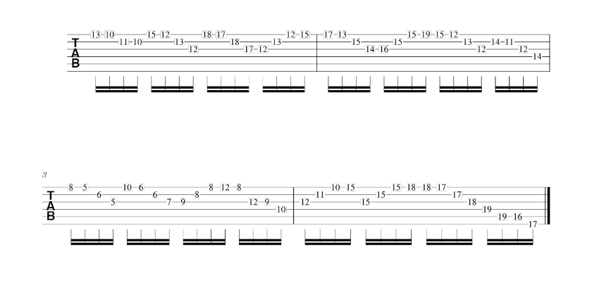
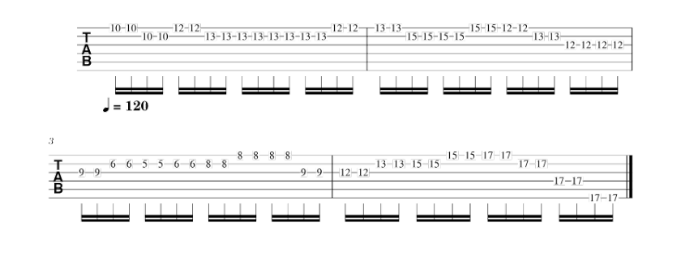

# 単旋律タブ譜の簡略化

## 概要
このプログラムは、読み込まれた単旋律ギタータブ譜の音高を変化させ、初心者用のタブ譜を出力するプログラムです。
`main.py`でファイル名を書いて実行すると、出力されます。

**入力したタブ譜**


**出力されるタブ譜**



## データの用意
現在`XML`ディレクトリにMusicXMLファイルが入っています。
自分で用意したい場合は、museScoreでギターのタブ譜を作成し、エクスポートでMusicXMLファイルにできます。

単旋律のタブ譜のみ扱えるので，2つ以上押さえるタブ譜は使用できません．

## 必要なライブラリ
このプログラムを動かすのに必要なライブラリは以下の通りです。
以下のコマンドで、`music21`、`glob`、`itertools`、`numpy`、`os`をインストールしてください。

```bash
pip install music21 glob itertools numpy os
```
インストールができたらこのプログラムを動かせます．

## プログラムの説明
基本的に，main.pyを実行すればプログラムは動きます．


何も考えないでプログラムを実行したい人は，以下の部分を見てください．
```python
    file = "XML/Motor_Man.musicxml"
    base_score = MusicScore(file, 0.5) #1.0だと四分音符レベル，0.5だと八分音符レベル
    base_score.analyze_notes()
    base_score.analyze_hmm()


    score1 = MusicScore1(base_score)
    score1.update_notes()
    output_name1 = os.path.join("out", os.path.splitext(os.path.basename(file))[0] + "_output1_0.5.musicxml")
    score1.generate_score(score1.notes, output_name1)
```

`file = "XML/Motor_Man.musicxml"`
となっている部分を自分の好きなファイルに変えるだけで大丈夫です．
もちろんMotor_Man.musicxmlのままでも実行できます．

`base_score = MusicScore(file, 0.5)`
となっているところは1.0か0.5にすることで結果が変わります．
四分音符レベルで簡略化したいときは1.0，八分音符レベルで簡略化したいときは0.5にしてください．オススメは0.5です．


### コメントアウト部分の説明
```python
    # for xml_file in get_musicxml_files("XML"):
        # base_score = MusicScore(xml_file, 1.0)
        # base_score.analyze_notes()
        # base_score.analyze_hmm()

        # score1 = MusicScore1(base_score)
        # score1.update_notes()
        # output_name1 = os.path.join("out", os.path.splitext(os.path.basename(xml_file))[0] + "_output1.musicxml")
        # score1.generate_score(score1.notes, output_name1)

        # score2 = MusicScore2(base_score)
        # score2.update_notes()
        # score2.update_quarter_notes()
        # output_name2 = os.path.join("out", os.path.splitext(os.path.basename(xml_file))[0] + "_output2_1.0.musicxml")
        # score2.generate_score(score2.quarter_notes, output_name2)

```
コメントアウトされている部分の説明をします．
このコードはもし実行したら，XMLディレクトリに入っている全てのMusicXMLを読み込み，結果を出力してくれます．
もし実行したかったら，コメントアウトを消して普通に実行してください．
時間は割とかかると思います．


